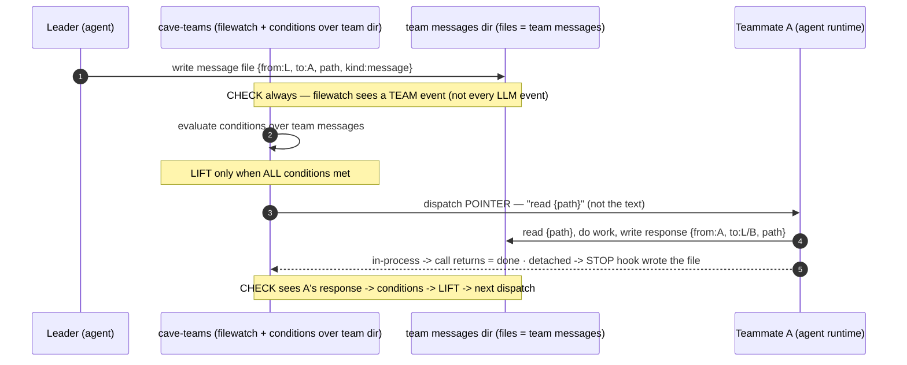
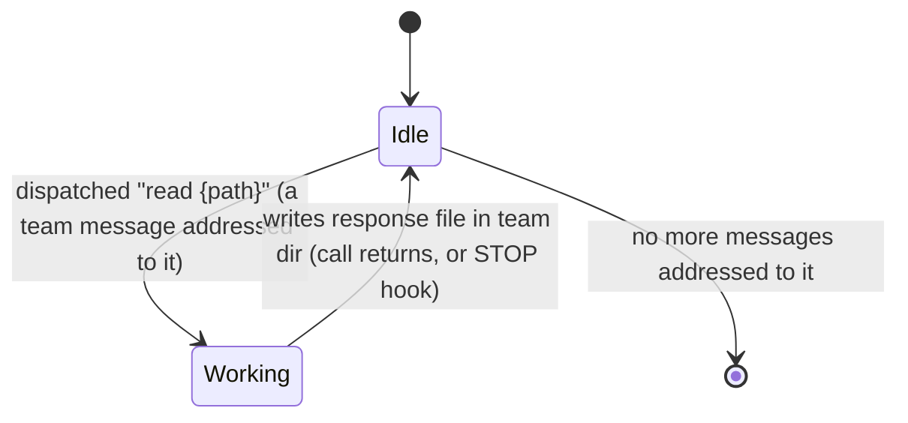
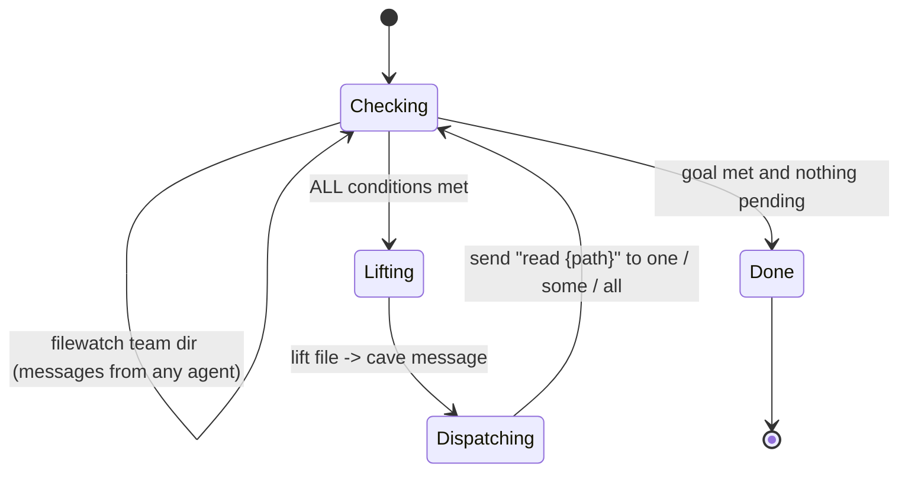

# Rule 01 — The Pattern (conditions on messages, where messages are FILES)

> **THE MAIN THING.** cave-teams uses *state machines / conditions on MESSAGES*. Messages are **files in a per-team messages dir**. cave-teams is the **equipment** to run this *on cave* — cave gives the central event system; cave-teams adapts it. The algebra / topologies / DSL are a generator that emits these conditions.

## In Isaac's words (verbatim — see `THE-ONLY-SOURCE-OF-TRUTH.md` for all)

> there is a team leader · there is a team · messages go **from the leader → one/set/all teammates** · then **notify leader when a teammate goes idle** · **async**; the leader kicks them off with a single message or a broadcast to all/some.

> we instruct teammates to write their final responses **inside a messages dir for that team**, then dispatch that way. The `paia*` hooks exist to **join a totally disconnected runtime to the server**; but **running agents without tmux, we just know when they return** — *i dont know if we need the hooks*.

> cave-teams provides all the **equipment** to build this **on cave** — cave is a good **central event system**; it just needs **adaptation (filewatching)** so it expects messages that way, **so it's not picking up literally every LLM event but ONLY the team events**.

> you **lift ONLY when conditions are all met**, but you **check all the time** for messages from every agent. Agents are told to **read the files** — *don't send the message text, send a message saying to read `{path}`, and respond in the team dir*. We know **who is messaging who** via the **team event/message format**.

## The adaptation: cave's firehose → team events only

- cave provides a **central event system** — a good one — but it fires on **every LLM event**.
- cave-teams **adapts it with a filewatcher on the team messages dir** so the team reacts to **ONLY team events** (the file-messages), not the whole LLM event stream.
- **The team messages dir IS the team-event channel.** Watching it = subscribing to team events only.

## The message medium + format

- A **message = a file** in `<team>/messages/`.
- The **team message/event format carries who → who**: `{ from, to, path, kind, ts }`. That is how routing is known.
- **Dispatch sends a POINTER, not the payload.** The message to an agent says **"read `{path}`"** — never the message text. The agent **reads the file at `{path}`**, does its work, and **writes its response into the team dir**.
  - *Pointer-not-payload* = never-truncate (big payloads stay on disk) **and** keeps the event/message bus light (events carry a path, not a blob).

## CHECK always · LIFT on condition (the gate)

- **CHECK** — *continuous*: filewatch the team dir for messages from **every** agent. Cheap; always on.
- **LIFT** — *gated*: promote a file → a cave message and **fire the dispatch ONLY when all conditions are met**. The lift **IS** the gated firing (`CHECK_CONDITIONS` before deliver).

## Run modes — who writes the response file (this is the only thing the hooks decide)

| Mode | who writes the response file | hooks? |
|---|---|---|
| **in-process (no tmux)** | the **runtime** writes it when the call returns — "we just know when they return" | **none** |
| **detached (tmux / external)** | the **agent's STOP `paia*` hook** writes it (the bridge that joins a disconnected runtime to the server) | yes — `paia*`, as an **adapter** |

> Conditions only ever read **files**, so the run-mode is **invisible** to the condition layer. The hooks are not the spine — they are one of two ways a file gets written.

## The loop (sequence)

## State machines

**Teammate:**

**Leader / the team runtime (check-vs-lift):**

## The bijection — pattern ↔ cave mechanism ↔ code

| The pattern (prose) | cave mechanism (adapted) | concrete |
|---|---|---|
| only **team** events, not every LLM event | filewatch the team dir instead of subscribing to cave's full event stream | watcher on `<team>/messages/` |
| message = file | a file in the team dir | `<team>/messages/<id>.json` |
| who → who | the team message format | `{ from, to, path, kind, ts }` |
| dispatch | send a **pointer**, not the text | message body = `"read {path}"`; agent reads + responds in team dir |
| **check** always | watch the dir continuously | filewatch / poll loop |
| **lift** on condition | promote file → cave message only when all conditions hold | `if all(conds): lift(file) -> dispatch` |
| notify leader when teammate idle | the response file appearing in the team dir | in-process: call returned · detached: STOP hook wrote it |
| make the server | build config + serve | `CAVEAgent(CAVEConfig(...))` + `CAVEHTTPServer(cave, port).run()` |

> The algebra is sugar over this: `a >> b` ⟶ "when a's response file exists, dispatch `read {path}` to b"; `a | b` ⟶ dispatch to both; `gate(body, φ)` ⟶ "re-dispatch while φ holds over the team dir"; `choice` ⟶ "dispatch to the branch whose guard fires." See `02-architecture-layers.md`.
