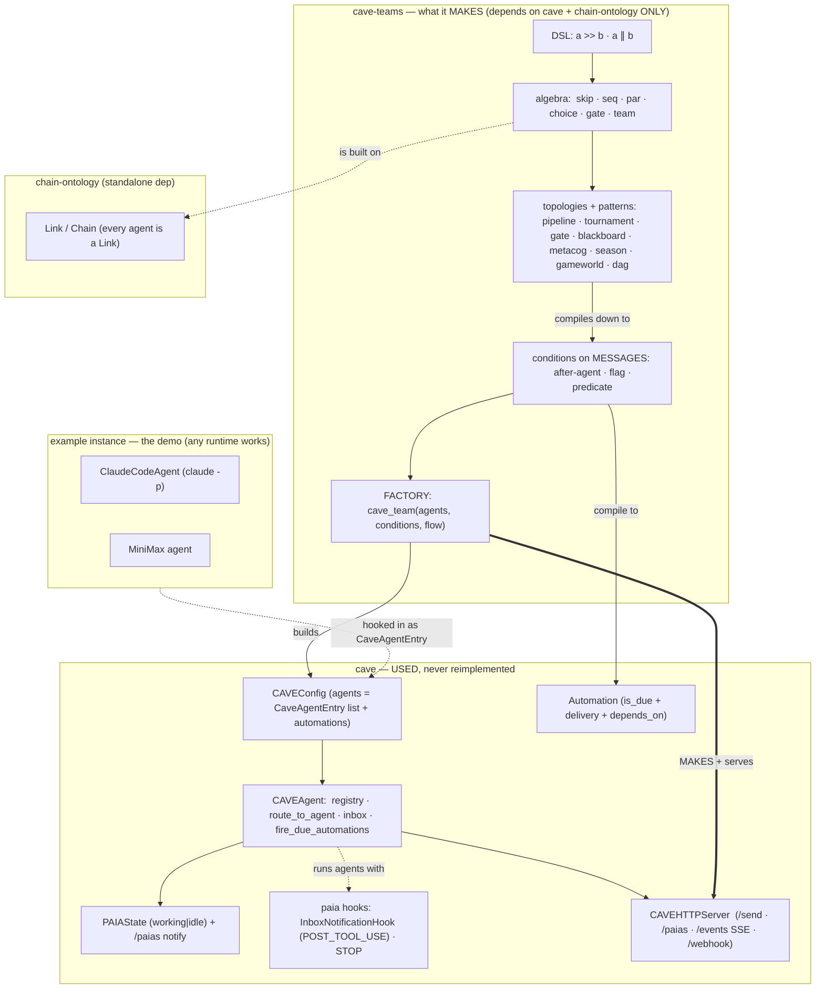
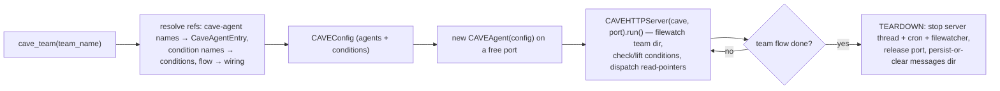
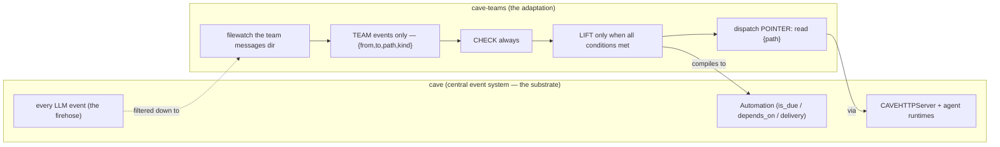

# Rule 02 — Architecture Layers (what cave-teams MAKES vs what cave PROVIDES)

> The disease in the original: an **example instance** (`claude -p` + MiniMax) was fused into **every** abstraction, on the wrong state machine/objects, so it couldn't be programmed. The cure: **neatly separate** the abstractions. This file is the separation.

## The layer / component diagram

## Terminology — `CAVEAgent` (the server) vs `cave_agents` (the team)

- **`CAVEAgent` ≡ `CAVEHTTPServer`** — the cave server *is itself an agent* (it can reflect on its own runtime); that's why it's named CAVEAgent, and why `CAVEHTTPServer` wraps a `CAVEAgent`. It is the **host**.
- **`self.cave_agents`** (the agents *inside* a CAVEAgent) are the **team members** — the leader + teammates that actually run the team. **These** are "cave's agents" (`ChatAgent`/`CodeAgent`/`ClaudeCodeAgent`/…), referenced by name.

## The factory + the ephemeral server lifecycle

**A cave-team, on start, spins up a NEW `CAVEHTTPServer` for itself, runs, and tears it down when finished.** Ephemeral, self-contained, standalone — the literal "it MAKES one, doesn't require one already running." One server per team (its own port + `cave_agents` + messages dir); a *stacked* sub-team is either an in-process Link (closure law) or its own child server reporting up via `parent_url`/`/paias`.

## The separation table (every current module → its verb)

| Layer | Current cave-teams files | Verb | Cave already provides it? |
|---|---|---|---|
| **L0 chain-ontology** (substrate) | `_chain_ontology_vendored.py`, `chain_ontology.py` | **REFACTOR** → *depend on* `universal-chain-ontology`, stop vendoring | n/a — it's the standalone dep |
| **L1 algebra / topologies / DSL** (what it MAKES) | `algebra`, `topologies`, `concurrent`, `dag`, `blackboard`, `season`, `gameworld`, `npc`, `metacog`, `evolve`, `sim`, `dsl`, `workflow` | **KEEP** (rewire onto L0 + cave-agent Links) | no — cave-teams' own |
| **L2 conditions on messages** | `conditions.py` (`wrap_cave_automation` is the seam) | **REFACTOR** → compile to cave `Automation` | **YES** — `core/automation.py` |
| **L3 the running** (actor model, inbox, events, runner) | `harness`, `events`, `conversation`, `leader`, `primitives`(runner), `orchestrator`(runner), `frontend`(server) | **USE-CAVE** → collapse once confirmed | **YES** — `inbox`, `inbox_hook`, `event_router`, `event_broadcaster`, `channel`(SSE), `hooks`, `server/cave_http_server` |
| **L4 the factory** | `adaptor`, `cave.py` (register / metacontrol) | **BUILD on cave** → `CAVEConfig` → `CAVEAgent` → `CAVEHTTPServer` | the parts exist; the factory is ours |
| **L5 example instance** (demo, not core) | `primitives`(backends), `heaven_minimax`, `conversation`, `jobworld`(app) | **SEPARATE** → `examples/`, hooked in via cave's `ClaudeCodeAgent`/agent-hook | cave has `ClaudeCodeAgent` already |
| **C reusable configs** | `cave.py` register + `scan_caves` | **KEEP** | partly (cave configs) |

## The adaptation: cave's firehose → team events only

cave-teams is the **equipment to run the file-message team system on cave**. cave already provides a strong **central event system** — but it fires on **every LLM event**. cave-teams' job is to **adapt it with filewatching on the team messages dir** so the team reacts to **only team events** (the file-messages), never the whole stream.

- **CHECK** is continuous (watch the dir); **LIFT** is gated (promote file → cave message → dispatch, only when conditions hold).
- Dispatch is a **pointer** (`"read {path}"`), never the payload — never-truncate, and a light bus.
- This is what makes it **like Claude Code Teams but programmable**: configs, conditions on messages, topologies saved as configs, stacked/subclassed as classes.

## Build status — VERIFIED end-to-end (2026-06-28)

The whole vertical slice is built and tested:
- **Pure spine (host tests, no cave):** `messages.py` (TeamMessage / TeamDir), `flow.py` (conditions + CHECK/LIFT), `wiring.py` (algebra→edges), `team.py` (Team three-faces + registries). `test_spine.py` / `test_wiring.py` / `test_team.py` all green.
- **Cave-coupled factory (container test, REAL cave):** `server.py` — `make_headless_cave` (CAVEAgent via `__new__` + `_init_sse` + `_init_cave_agents` + dirs; **no internal cave change needed** — cave untouched), `EphemeralTeamServer` (non-blocking uvicorn start/stop), `cave_team` (in-process dispatch via `agent.run` + `set_runtime`). `test_factory.py` green: `seq(alice, par(bob,carol), dave)` ran on a real headless CAVEAgent; server started + torn down; organ daemon logged "PASSIVE MODE (no World)".

So the **(b) headless mode was achieved WITHOUT going internal to cave** — the `__new__` + selective-init adaptation is enough.

**Refactor DONE (2026-06-28):** `__init__` now exports the new spine + the kept algebra/topologies/registry; the old reimplemented runtime (primitives/conversation/harness/events/leader/orchestrator/runtime/jobworld/adaptor/frontend/links) is dropped from the public API (files remain on disk — refactor, don't delete). `cave.py`'s `"agent"` op rewired `AgentLink`→`AgentRef` (a cave-agent name reference). Verified: host import of the new API + spine tests green; factory test green against real cave after re-sync. Remaining: claude-p/minimax as `examples/` with a real `set_runtime` backend (the real-LLM smoke test — Isaac to guide; `HeavenMiniMaxLink` suspected wrong).

## Resolved / open

- **`metacog` STAYS** — cave has no metacog module, so `MetacogShell(Link)` is a topology pattern (L1), not a runtime clone.
- **`⋈` dovetail + context-engineering** — canonical source is `sdna` / heaven, *not* chain-ontology or cave. Open question for Isaac: do these belong to the **standalone core**, or to the **SDNA-agent tier** ("once you get up to the top you make the cave-teams system for running SDNA agents")? Current read: the **SDNA-agent tier**, so the core stays `cave + chain-ontology` only.
- **Packaging (deferred):** cave-teams depends on cave, which lives in the monorepo (not PyPI). It's **cave-environment-native** for now; a host-pip standalone needs cave published too. PyPI `cave-teams 0.1.1` is wrong → yank.
