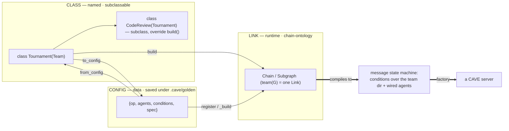
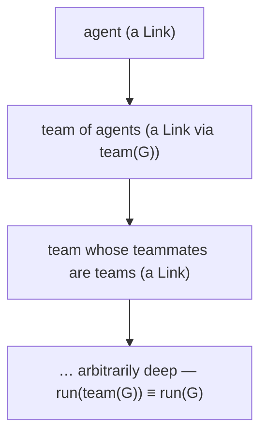
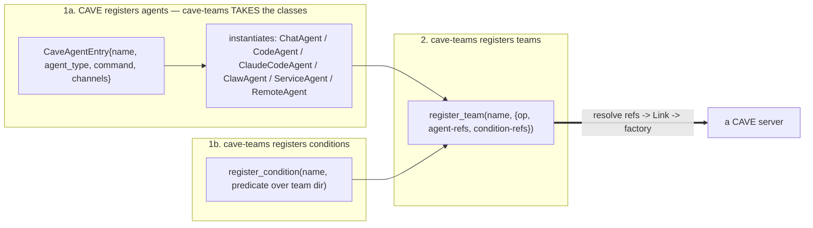

# Rule 03 — Topologies: written in code, saved as configs, stacked & subclassed as classes

> This is the layer that makes cave-teams **programmable** (vs Claude Code Teams' throwaway JSON): *"we have the ability to write topologies into them and save them as configs and stack them as classes and subclass etc."* (Isaac, verbatim).

## A topology has THREE faces (one object, three forms — the bijection)

| Face | Form | Mechanism in the code |
|---|---|---|
| **CLASS** | named · subclassable | `class Tournament(Team)` with `build() -> Link`; instantiate with agents + conditions; **subclass to override** — *(the gap to build)* |
| **LINK** | runtime · executable | chain-ontology `Chain` / `Subgraph`; **`team(G)` = a composition as ONE Link** (closure law) — *(exists: `algebra.py`)* |
| **CONFIG** | data · saved JSON | `{op, …}` tree → `register(op, builder)` / `_build(spec)` → Link; saved under `.cave/` (`_quarantine` → `_goldenize`, human-gated) — *(exists: `cave.py`)* |

All three **interlock through the `Team` carrier**: a Team `build()`s a Link, `to_config()`s to JSON, and `from_config()`s back — and the Link is what actually runs.



## The closure law — agent = team = agent (stacking)

`team(G)` is itself a Link, so **a team can be a teammate**. Compositions nest; the system is **closed under composition**; runtime stacking **is** hierarchy.



## The `Team` class (the gap to build) — the carrier of all three faces

```python
class Team(Link):                          # a Team IS a Link  → stackable (closure law)
    op: str                                # its registry op-name (for the config face)

    def __init__(self, agents, conditions=None, **spec):
        self.agents, self.conditions, self.spec = agents, conditions or [], spec

    def build(self) -> Link:               # OVERRIDE: compose the topology via the algebra
        raise NotImplementedError

    async def execute(self, ctx=None, **kw):   # a Team runs by running what it builds
        return await self.build().execute(ctx)

    def to_config(self) -> dict:           # CLASS → CONFIG
        return {"op": self.op, "agents": self.agents, "conditions": self.conditions, **self.spec}

    @classmethod
    def from_config(cls, spec: dict) -> "Team":   # CONFIG → CLASS
        return cls(spec["agents"], spec.get("conditions"), **{k: v for k, v in spec.items()
                                                              if k not in ("op", "agents", "conditions")})

    def __init_subclass__(cls, **kw):      # every subclass auto-registers as a config op
        super().__init_subclass__(**kw)
        if getattr(cls, "op", None):
            register(cls.op, lambda s, c=cls: c.from_config(s).build())
```

```python
class Tournament(Team):                    # a named topology
    op = "tournament"
    def build(self):
        return synthesis_gate(self.agents["competitors"], self.agents["judge"])

class CodeReview(Tournament):              # SUBCLASS — extend/override
    op = "code_review"
    def build(self):
        return super().build() >> self.fix_step()
```

- A `Team` **is a Link** → `team()`-able → stackable as a teammate (closure).
- A `Team` **subclass auto-registers** as a config `op` → it is *also* callable from a saved `.cave/golden/*.json` and from `cave()`.
- **Subclassing** = OOP reuse of a topology (override `build()`, call `super().build()`).

## The three reuse paths

1. **Stack** — `team(t)` a topology and drop it into a bigger one (closure law). Compose by value.
2. **Save** — `to_config()` → `_quarantine` → `_goldenize` → `.cave/golden/<name>.json`; `scan_caves` finds every `.cave` across projects. Reuse by data.
3. **Subclass** — `class Mine(SomeTeam)` overriding `build()`. Reuse by type.

## The registration order (Isaac: "register agents + message-condition configs FIRST, then team configs")

Three things get registered, in **dependency order**. **CRUCIAL: agents are CAVE's** — cave-teams does **not** define agent registration; it **takes cave's agent classes**.

1. **agents — CAVE's registration.** Make a cave agent: a `CaveAgentEntry{ name, agent_type: chat|code|claw|service|remote, command, working_dir, channels }` in `CAVEConfig.agents` → cave instantiates the right **cave class** (`ChatAgent` / `CodeAgent` / `ClaudeCodeAgent` / `ClawAgent` / `ServiceAgent` / `RemoteAgent`); or programmatically via `register_agent(agent_id, …)`. **cave-teams takes these classes — no cave-teams `register_agent`.** The claude-p + MiniMax example instance is just `CaveAgentEntry`s (`agent_type="code"` → `ClaudeCodeAgent`).
2. **message-condition configs — cave-teams' registry.** Register the conditions over the team dir (predicates / `register_fn` callables, referenced by name).
3. **team configs — cave-teams' registry.** `register_team(name, { op, agents: <cave-agent names>, conditions: <condition names>, spec })` — composition **by reference**. Auto-registered when you subclass `Team`.

Steps 1–2 are the primitives (FIRST); step 3 composes them (THEN).



- A **team config** = `{ op, agents: <cave-agent names>, conditions: <condition names>, spec }` — composition **by reference**, not by inlining. Register a cave agent or a condition **once**, reuse it across many teams.
- cave-teams' side rides on the existing seams: `register(op, builder)` (team ops) + `register_fn(name, fn)` (callable conditions) in `cave.py`. A `Team` subclass auto-registers its `op`, so registering a team class IS step 3.
- The **agent registry is cave's** (`CAVEConfig.agents` / `AgentRegistryMixin` / `self.cave_agents`). cave-teams holds only the **conditions** and **teams** registries; agents are referenced by their cave names. This is **reusable configs (C)** + the **CONFIG face**.

## Compile path (how this layer reaches the spine in rule 01)

Any face → a **Link** → the factory compiles the Link's structure into **conditions on messages** (edges → file-watch conditions over the team dir) + **wired agents** → **makes a CAVE server**. Authoring lives here (rule 03); the runtime is the message state machine (rule 01); the server is what gets made (rule 02).

## EXISTS vs TO-BUILD

- **EXISTS** (keep / rewire): `team()` + `Subgraph` (closure), the algebra (`seq/par/choice/gate/dovetail`), the topology combinators (`tournament/synthesis_gate/loop_refine/round_robin/dag/blackboard/season/world`), the config registry (`register`/`_build`), the golden library (`.cave/` quarantine → golden), `scan_caves`.
- **TO-BUILD**: the `Team` base class (the subclassable carrier) + the class↔config bijection (`to_config` / `from_config` / `__init_subclass__` auto-register).
