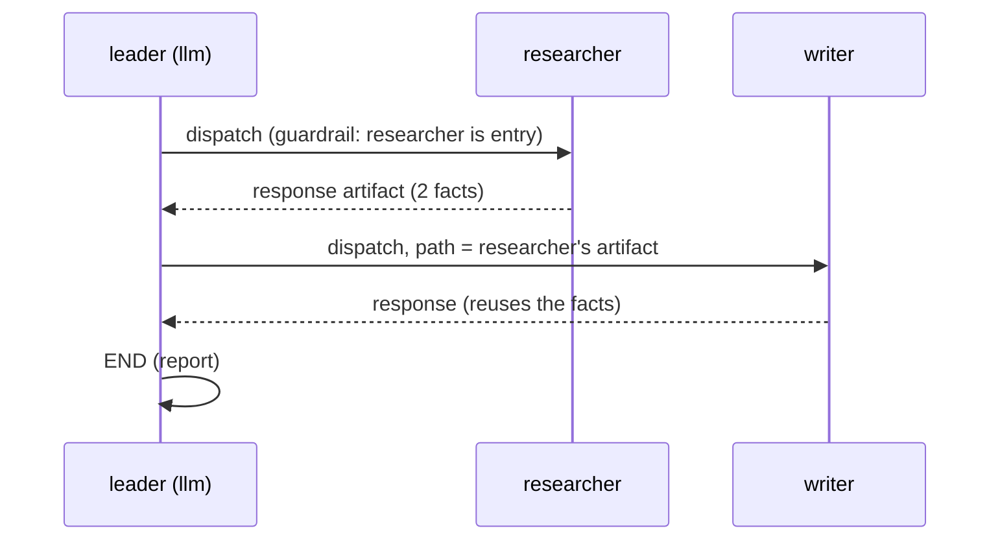
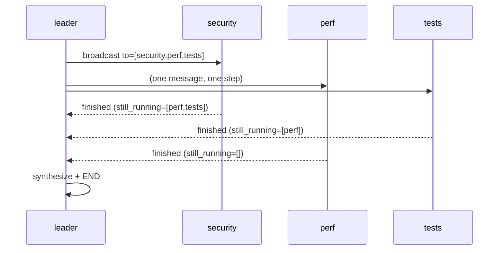
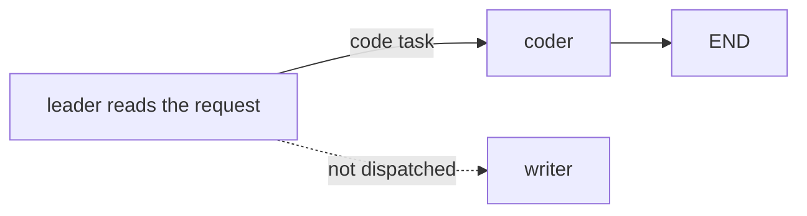
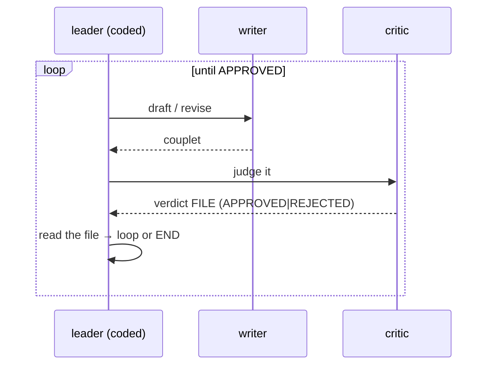
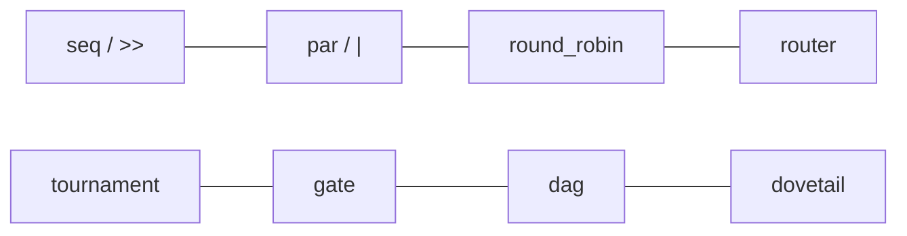
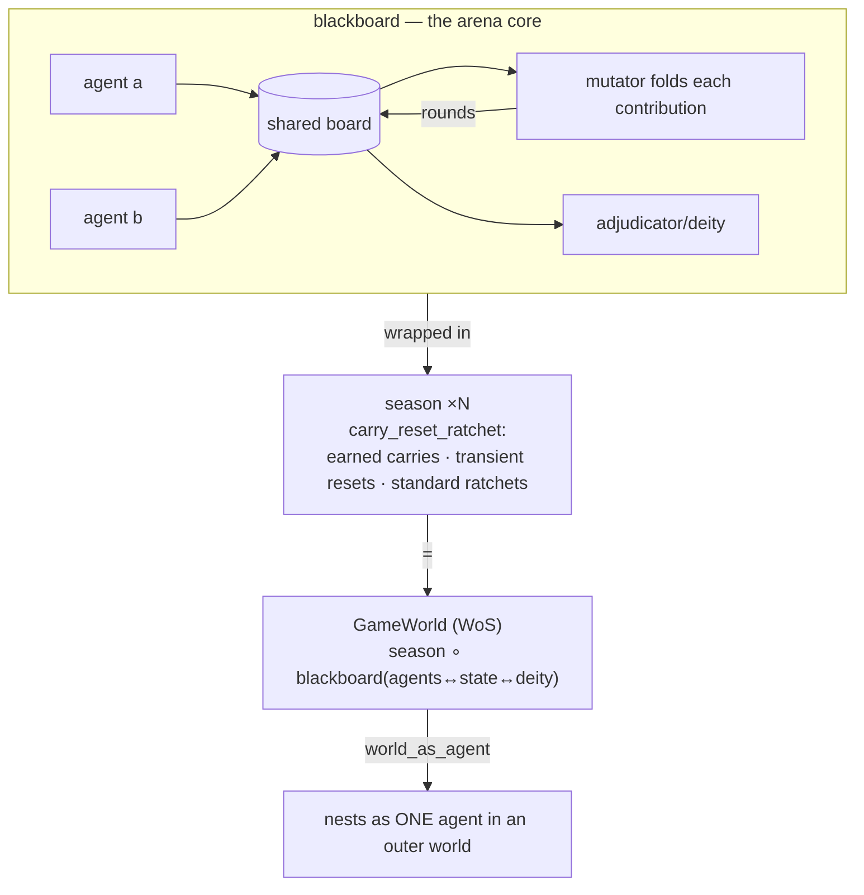
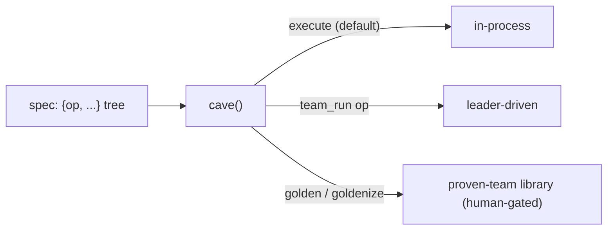

# cave-teams — every verified topology, diagrammed

The topology configurations cave-teams ships, each with **how it actually executes** and the
**receipt** from a real run (real MiniMax/Claude agents, interactions read from the message files /
histories — not pass flags). GitHub renders the mermaid inline. Companion to the curriculum
(`cave-teams.manifest.json` → the SkillTree) and the leader-spine skills (`cave-run-team`,
`cave-leader`, `cave-messages`).

Two runtimes underlie all of it:
- **in-process** — `await team.execute(ctx)` threads a Python dict through the links.
- **leader-driven** — a leader routes **message files**; a guardrail gates turn-order; teammates run
  concurrently. This is the real runtime; the diagrams below are the leader-driven plane unless noted.

---

## The leader types (who decides the next message)

```mermaid
flowchart LR
  subgraph L["LeaderFn — 3 kinds"]
    raw["raw / coded<br/>a Python fn decides"]
    llm["llm_leader<br/>an LLM emits JSON"]
    file["file_leader<br/>an LLM writes a msg FILE"]
  end
  raw --> P[Proposal: to · prompt · path · wait · end]
  llm --> P
  file --> P
  P --> G{{"check_proposal<br/>(the guardrail)"}}
  G -->|invalid| RP["re-prompt leader with {e}"] --> P
  G -->|valid| D["deliver → teammate inbox → run"]
  classDef n fill:#1b4,color:#fff; class file,llm,raw n
```

Verified: **coded** (the loop leader that reads a verdict file), **llm_leader** (drove sequential /
parallel / branch), **file_leader** (the `cave_team` server default; the CEO-as-file-leader in the
JobWorld round). Finding: a **tool-less** llm_leader can't gate a loop on a teammate's verdict —
pointer-not-payload hands it the file *path*, never the content, so verdict-gating needs a
coded/file leader.

---

## 0.2.1 Sequential (`seq` / `>>`)


**Verified:** honeybee blurb — the writer's output reused the researcher's exact facts
("80,000 bees / 80% pollination"); the file hand-off carried info between contacts.

## 0.2.2 Parallel / broadcast (`par` / `|`)


**Verified:** `/login` review — one broadcast to the set, 3 concurrent tasks, reaped per-finish with
a shrinking `still_running`; leader synthesized all three artifacts.

## 0.2.3 Branch (`choice` — leader behavior, not edges)


**Verified:** "fix the NullPointerException in auth.py" → leader dispatched **only** `coder`, skipped
`writer`, ended. (`choice`/`gate` deliberately don't compile to guardrail edges — branching/looping
is the leader's job via `open_rules`.)

## 0.2.5 Loop (`gate` — leader behavior)


**Verified:** couplet loop — a **coded** leader read the critic's verdict file and ended on APPROVED;
the guardrail allows re-dispatching an already-responded agent (revision loops); `max_steps` bounds it.

---

## The file-message spine (what every leader-driven run writes)

```mermaid
flowchart TB
  LO["leader_outbox/msg_007.json<br/>(proposed)"] -->|check_proposal| GATE{{guardrail}}
  GATE -->|valid| INB["inbox/&lt;teammate&gt;/…json<br/>(delivered)"]
  GATE -->|invalid| RE["re-prompt leader"]
  INB --> RUN[teammate runs, reads the pointed-at file]
  RUN --> ART["artifacts/&lt;name&gt;-response-N.txt<br/>(the payload)"]
  RUN --> MSG["messages/…json (kind=response,<br/>path→artifact, text=preview)"]
  classDef f fill:#851,color:#fff; class LO,INB,ART,MSG f
```
**Verified:** live run where the guardrail BLOCKED an out-of-turn dispatch
("It isn't writer's turn — these can run now: ['researcher']"); a message is a JSON file, dispatch is
a pointer to a file, a response is an artifact file. The whole JobWorld Workday round runs on this.

---

## The in-process algebra (8, run via `.execute()`)


**Verified 8/8** (dict threaded through the links): pipeline · fan_out · round_robin · router ·
tournament · gate · dag · dovetail.

---

## World features (leader-driven server teams / arenas)


**Verified:** **blackboard** (2 agents ↔ board, 2 rounds, mutator folded all writes) · **season**
(2 epochs; `record` carried, `scratch` reset) · **evolve** (child inherits the winner's AIOS dir,
session memory wiped) · **npc** (`call_npc` → real Oracle NPC → artifact into inventory) ·
**nested worlds** (a whole GameWorld ran as one agent in an outer world) · **WoS micro** (ada/bo
craft→list→buy, a deity awards xp, season carries skills + ratchets craft_cost; skill composition
emerged). *(metacog is a topology/opinion, not a world feature — not tested, per Isaac.)*

---

## cave() — drive any of the above from a data spec


Every `cave-&lt;pattern&gt;` skill gives that pattern's `op` shape; a malformed spec returns
`{status: construction_error, hint: "read the cave-&lt;op&gt; skill"}`.
